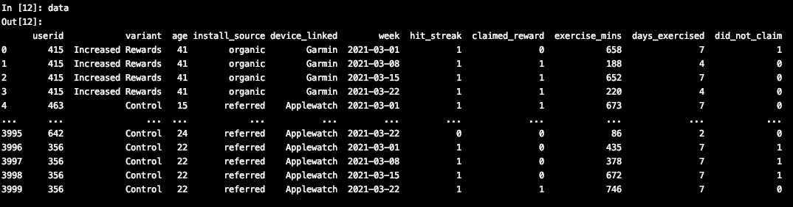

# Paceline Take Home

### Sections
Assumptions
Exploratory Data Analysis
KPI
Population Analysis between Control and Increased Rewards groups
Graphs
Results
Areas for Improvement

## Assumptions 
- Table grain appears to be an aggregation of the week's data for each user. 
- There are 1000 users across 4 weeks each for 4k rows total. 
- claimed_reward can only be 1 if hit_steak is 1
- When claimed_reward is 0 when hit_streak is 1 indicates a
 "did not claim" week for the user.  In the below screenshot an example of this would be index 0 where userid 415 hit
  their streak but did not claim their rewards.  
- I am calling this out as its instrumental to the analysis. 

## Exploratory Data Analysis
- There are relatively equal numbers across the claimed_reward variable, 287 rewards were claimed by users across the
 four weeks in the Control group vs 373 in the Increased Rewards group. 
- 1412 Control users hit the streak and 1821 of the Increased rewards users hit the streak. 
- A new variable was created `did_not_claim` which tracked the target population of users who ***hit a streak but did
 not claim***.  Clearly the disparity from the above bullet points foreshadows this next group.  1125 rewards were 
 unclaimed by Control users while 1448 rewards went unclaimed by the Increased Rewards Users. 
  

## KPI
- The variable did_not_claim is the variable of interest that this experiment was designed to affect. 
- Ideally we want to see lower rates of `did_not_claim` in the treatment population.  

## Population Analysis between Control and Increased Rewards groups
- There were no statistical differences between the Control and Increased Rewards populations.  I suspect no biases
 resulting from population mismatches. 
- Mean age for both populations was 28 with a stdev of 9, therefore no bias resulting from age. 
- It appears the Increased Rewards population exercised more per week at 347 minutes vs 287 minutes for Control, but
 with standard deviations of 187 and 206 minutes, respectively, these two populations did not exercise for a
  statistically significantly different amount of time. 
- The Control group claimed rewards at a rate of 14% of the weeks vs 18% for the Increased Rewards. This is great
 news that the Increased Rewards group has a higher rate, however 72% of the weeks the Increased Rewards group did
  not claim a reward when they had a streak vs only 56% of the Control Group. This means the Control group claims
   their rewards more often than the Increased Rewards Group!  

## Graphs

- Increased Rewards Group exercised for more minutes than the Control group, but it was not statistically significant. 

- It is clear the Control group did a better job at not forgetting their rewards!

- The paid ad group had the highest did_not_claim rates (notice the purple lines are higher than their treatment
 groups).
- Referred appears to have the lowest did_not_claim rates, i.e. the highest ratio of remembering to claim their
 rewards when they hit a weekly streak.  

## Results
- The Increased Rewards group actually forgot to claim their rewards at higher rates than the Control group. 
- There was zero impact from the install_source on the claim_rate, this indicates that paid_ads might not help the
 did_not_claim KPI but it may help other KPIs like volume.  
- Install Source was however correlated with the did_not_claim rate.  Paid Ads were worst across populations for the
 did_not_claim rate.  Meaning those who became users from a paid add are the ones either forgetting to claim, or not
  caring to claim. 
- Referred Install Source had the lowest did_not_claim rate.  The story here could be that the user's friend referred
 them to the app and the word of mouth connection makes the user more likely to engage and claim their rewards.  

## Areas for Improvement

The two biggest areas to improve this analysis are:
1. Data on the dollar value of the rewards to be claimed. Clearly if someone has a chance to claim $50 in rewards in
 a given week they will be more motivated to exercise and use the Paceline app to get their reward than someone who
  can only claim $0.50 that given week. 
2. In this analysis, users were assigned to treatment and control groups at the start of the given data set.  An
 ideal way to design the experiment and data would be to provide a previous month of data (like February 2021) where
  all users were all on the control rewards program, and then the March 2021 data where half of the group is in the
   treatment and half is in the control.  Having that extra month of data would allow us to run a difference-in
   -difference analysis that controls for any bias in the population.  Difference-in-difference can be computed by
    hand or within a regression analysis to better determine the impact of the experiment on the independent variable
     (in this case the did_not_claim variable).  Without this data it is extremely difficult to tell if the claim
      behavior of these two groups was identical or not to begin with.  